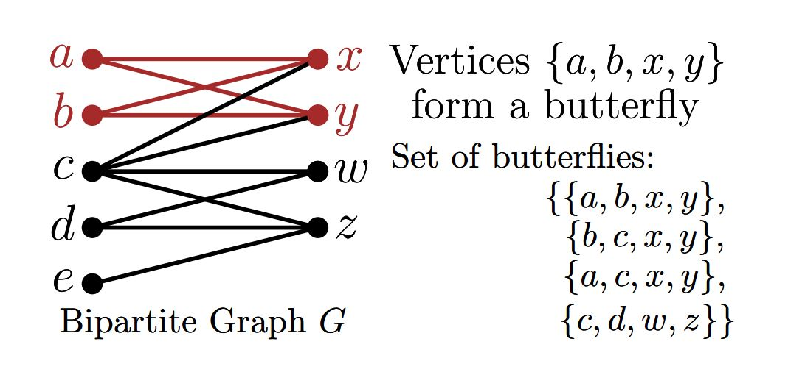
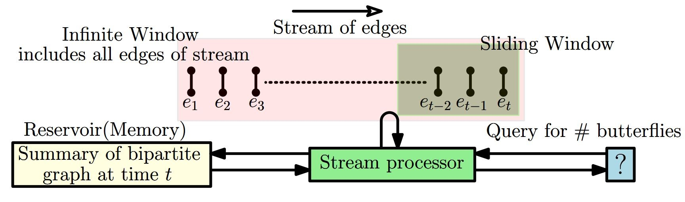
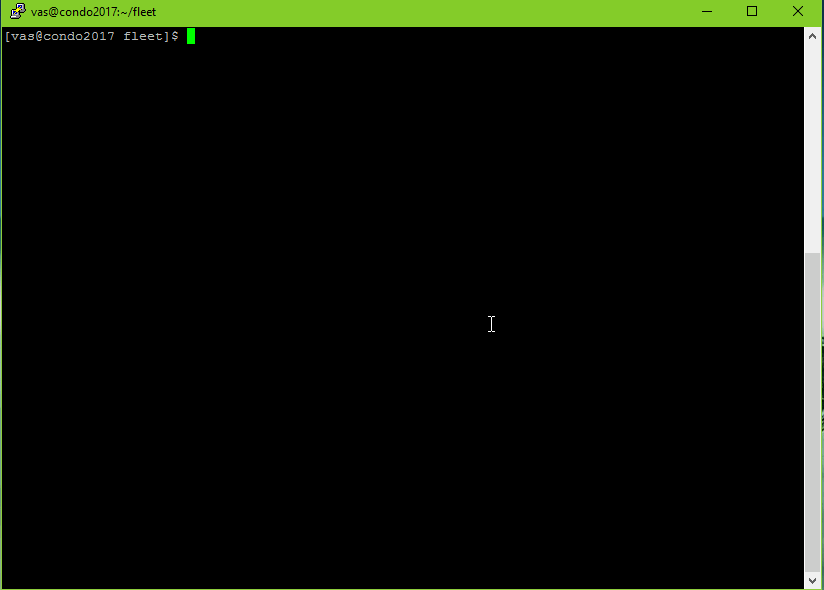

<h1 align="center">FLEET:  Butterfly Estimation from a Bipartite Graph Stream</h1>


<h3>Abstract</h3>
We consider space-efcient single-pass estimation of the number
of butterflies, a fundamental bipartite graph motif, from a massive
bipartite graph stream where each edge represents a connection between entities in two different partitions. We present a space lower
bound for any streaming algorithm that can estimate the number
of butterflies accurately, as well as FLEET, a suite of algorithms
for accurately estimating the number of butterflies in the graph
stream. Estimates returned by the algorithms come with provable
guarantees on the approximation error, and experiments show good
tradeoffs between the space used and the accuracy of approximation. We also present space-efcient algorithms for estimating the
number of butterflies within a sliding window of the most recent
elements in the stream. While there is a signifcant body of work on
counting subgraphs such as triangles in a unipartite graph stream,
our work seems to be one of the few to tackle the case of bipartite
graph streams.<br></br>

<p align="center">
  
  <figcaption> 
    Four butterflies in the entire graph G.
   </figcaption>
</p>

<p align="center">
  
  <figcaption> 
    Set up for processing a graph stream.
   </figcaption>
</p>

<h2>Compiling and Running the Code</h2>
To compile the code, make sure two prerequisite software already be installed on your computer:

  - Make tools: we use CMake for managing the build process, version ≥ 2.8.
  - C++ Compiler: g++ or visual studio C++, support C++11 standard.
  
Our code includes the file CMakeLists.txt for program build, please use the following steps to compile and build to generate executable program:
  - In the source code folder, type “cmake CMakeLists.txt”.
  - Run “make”, there will generate executable program named ”stream_bfly”.
  - Run “./stream_bfly [option]” to start, where option is the algorithm name. For example, use command “./stream_bfly Fleet1” to run the Fleet1 algorithm. Please refer main.cpp for all the algorithm names.
  

<h3> Parameter Settings </h3>
Our program provides a user-friendly way to interactively input the parameters. After execute the “stream_bfly” command, please check the printed messages to type in the parameters. The parameter γ is the sub-sampling probability – please refer to the paper
for the impact of this parameter. A good value for this parameter is 0.75. The parameter M is the reservoir size – please refer to the experiments section of the paper to get an idea of the ranges of M
that lead to good relative errors for the datasets that we have used.

For sequence-based sliding window, there is a parameter called “power of γ ”, which sets the sampling probability based on the ratio of the memory budget to the window size M/W . For example, when M/W is 5%, set this parameter to be 28, as 0.9 28 ≈ 0.05. Note that this code uses a default value of 0.9 for γ.

<p align="center">
  
</p>

<h2> Our Previous Work on Butterfly Counting in Static Bipartite Graphs</h2>
<h4>
You may find our paper on ArXiv: https://arxiv.org/pdf/1801.00338v4.pdf
</h4>
<h4>
This paper is published in KDD2018: https://dl.acm.org/citation.cfm?id=3220097
<h4>

Please use the following BiBTeX for citing this paper:
```bibtex
@inproceedings{sanei2018butterfly,
  title={Butterfly Counting in Bipartite Networks},
  author={Sanei-Mehri, Seyed-Vahid and Sariyuce, Ahmet Erdem and Tirthapura, Srikanta},
  booktitle={Proceedings of the 24th ACM SIGKDD International Conference on Knowledge Discovery \& Data Mining},
  pages={2150--2159},
  year={2018},
  organization={ACM}
}
```
